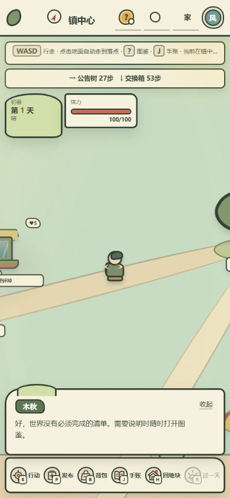
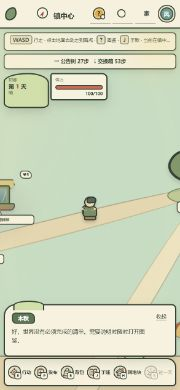
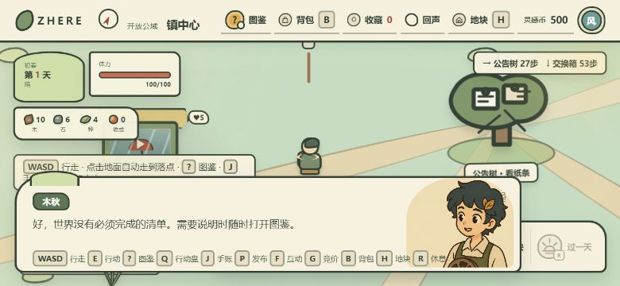

# P2 界面、性能与长期可玩性审查

审查日期：2026-08-13

审查范围：移动端 HUD、世界移动渲染、`prototype.js` 结构、长期内容循环。

## 结论

P2 不是完全没有实现，而是“基础优化已完成，验收与第二阶段仍未完成”。

- 390×844 竖屏：HUD 各层无几何重叠，长文本按单行截断，基础布局通过。
- 844×390 横屏：对话框与行动栏重叠；宽度大于 820px 后错误使用桌面布局。
- 780×390 横屏：使用移动布局，但生命 HUD 与对话框重叠。
- 地形渲染：已经使用超扫缓存和 `translate3d`，不再每帧重建地形或光晕 DOM；旧结论已过时。
- 移动性能：仍在每个移动帧查询多组 DOM、重建若干 Map 并逐节点写入位置，低端设备仍有掉帧风险。
- 代码结构：`prototype.js` 当前约 6674 行，模块化 P2 尚未实施。
- 长期玩法：种植、建造、季节、采集再生、区域发现、公共素材与需求已形成基础循环，但区域事件池、可忽略的 NPC 故事线、建筑升级层级和素材驱动动态地点仍不足。

## 测试步骤

1. **进入本地隔离测试世界**  
   健康度：正常。入口、新手选择、自由探索均可进入。

2. **390×844 竖屏 HUD 回归**  
   健康度：通过（浏览器视口）。顶部栏、提示、导航、生命 HUD、对话和行动栏没有几何重叠。长提示被截断，属于现有设计策略。尚未覆盖真实手机安全区、浏览器地址栏伸缩和触摸手势。

   

3. **844×390 横屏 HUD 回归**  
   健康度：失败。由于 `max-width: 820px` 不生效，页面落入桌面布局；对话框覆盖上下文提示，并与底部行动栏相交。

   

4. **780×390 窄横屏 HUD 回归**  
   健康度：失败。移动布局生效，但 `life-hud` 固定在 158px，展开对话从 210px 开始，二者发生重叠；可游玩区域也被上下 HUD 大幅压缩。

   

5. **移动渲染代码审查**  
   健康度：部分通过。地形在超扫范围内只移动缓存层，跨出阈值才重建；上下文检测降低到 100ms 一次。剩余成本主要来自逐帧 DOM 查询、Map 构造、逐节点位置写入和常驻动画循环。

6. **长期内容循环审查**  
   健康度：基础可玩。当前有 5 个成长阶段、3 种作物、5 个制作配方、6 个区域珍藏、5 个每日世界事件、6 类建筑、16 块地、5 个命名区域，以及公共素材/需求动态内容。深度不足集中在区域专属事件、NPC 连续关系、建筑多级变化和远距离探索的新奇度。

## 建议顺序

### P2.1 横屏 HUD 与真实设备验收

- 增加 `max-height: 500px` + `orientation: landscape` 布局，不再只按宽度判断移动端。
- 横屏默认折叠对话，生命 HUD 改成单行紧凑条；上下文提示和导航合并成一条。
- 使用 `env(safe-area-inset-*)` 保护刘海、圆角和浏览器工具栏。
- 固化 390×844、844×390、780×390 三个自动截图回归，再补 iOS Safari、Android Chrome/微信内置浏览器实机。

### P2.2 移动渲染第二阶段

- 缓存视频、纸条、资源和光晕的节点注册表；只在内容变化时重建 Map，不在每个移动帧重建。
- 给所有世界对象建立统一相机层，常规移动优先移动图层；附近检测保持 10Hz，真正需要交互的少量节点再单独更新。
- 只保留视口附近的素材和光晕节点，复用离屏节点；当前测试世界存在 52 个光晕节点，虽不重建但仍逐帧遍历。
- 静止时暂停不必要的动画帧；猫、海鸥等环境动画改为 CSS 或低频更新。
- 建立性能门槛：中端真机移动时目标 55–60 FPS，P95 帧耗时不超过 20ms，明显长帧需记录对象数和重建原因。

### P2.3 渐进式拆分 `prototype.js`

先抽纯数据和纯函数，不进行一次性重写：

- `world/terrain.js`：区域、地形、障碍、相机与可见性。
- `world/movement.js`：键盘、点击寻路、碰撞和到达回调。
- `systems/homestead.js`：种植、天气、季节、建造、制作。
- `systems/public-content.js`：公共素材、需求、回应与摆放。
- `telemetry/events.js`：曝光、行为和研究事件。
- `ui/sheets.js`：弹层、对话、图鉴和 HUD。

每抽一块先补契约测试，保持当前玩法和接口不变。

### P2.4 长期可玩性第二阶段

- **区域事件牌库**：每个区域 8–12 个可重复组合事件，受季节、天气、公共内容和玩家行为影响。
- **可忽略的 NPC 故事线**：NPC 记住玩家曾看过、回应过或带回家的素材，形成 3–5 步的非强制关系线，不引入任务中心压力。
- **建筑多级升级**：每栋建筑至少 2–3 级，升级要改变地图外观和操作能力，不只增加数值。
- **素材驱动动态地点**：根据公共素材标签、需求类型和近期活跃度生成临时放映棚、需求营地、主题交换角，让用户内容直接改变世界。
- **区域生成语法**：远距离区域使用不同地貌组合、微型地标、稀有发现和路径形态，稳定种子保证“可记住”，事件池保证“会变化”。
- **季节真实影响**：季节不仅改作物条件，还改变公共世界视觉、资源表、可达路径、NPC 出现和区域事件。

## 验收定义

P2 可视为完成，需要同时满足：

1. 三种关键移动视口无 HUD 重叠，真实手机完成触摸与安全区回归。
2. 中端手机连续行走和自动寻路无明显卡顿，并有可重复的性能记录。
3. `prototype.js` 的世界、玩法、采集和 UI 至少完成第一轮边界拆分。
4. 玩家在不同区域连续游玩 30–60 分钟时，能遇到区域差异、内容变化和至少一条持续反馈链，而不是只看到重复地貌。
